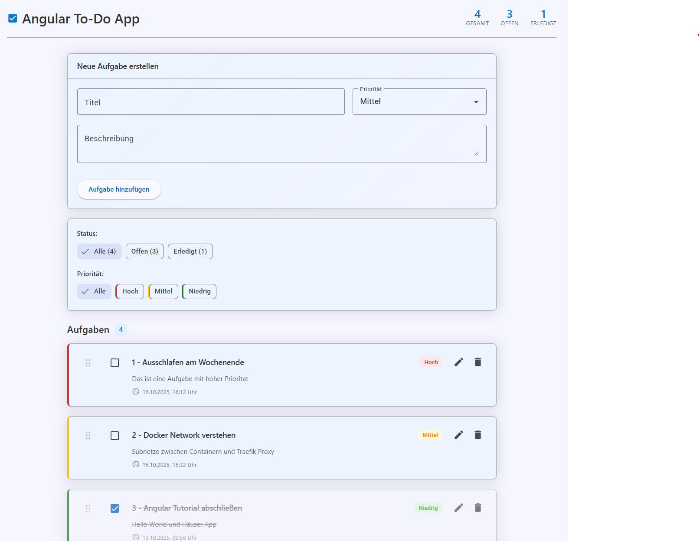

# Angular To-Do App
Für die Einführung in Angular.

# Speicher
ToDo Einträge werden in einen Array Todo[] gespeichert.

# Features
- Volle CRUD Funktionen
- Filter nach Priorität und Status
- Manuelles sortieren der Aufgaben mit Drag & Drop (@angular/cdk/drag-drop)
- Angular Materials (Button, Form, Icons, Input, ...)
- Zusammenfassung der Aufgaben nach Status

# Funktion
- app.ts main component für todo management logik mit Angular signals über todo.service.ts
- app.html benutzt eine Vorlage für Material UI components für input form, Filter und Aufgaben liste
- Data layer: 
todo.model.ts definiert todo struktur mit Id, Titel, Beschreibung, Priorität, Status (erledigt | nicht erledigt) und Erstellungsdatum - todo.service.ts ist der Service zur Verwaltung mit Signals, bietet CRUD Funktionen

# Probleme und Verbesserungsmöglichkeiten
- Drag and Drop ist während der bearbeitung exisiterender Tasks möglich
- Dark Mode nicht mehr unterstützt (seit Angular Materials)
- Todo ID nicht konsistent
- Footer Hintergrund erzeugt visuelle Fehler
- Allgemeine UI/CSS Verbesserungen notwendig
- Idee: Sortierung von Tasks nach Eigenschaften und Suchfeld
- Datenbank hinzufügen
